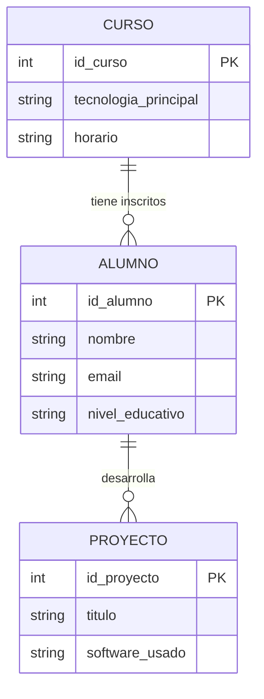

# 01. Diagramas Entidad-Relación (DER)

Para crear una base de datos robusta para nuestros proyectos (ya sea para un sistema de login en Unity o un ranking de puntuaciones en Java), el primer paso es el **diseño lógico**. El Diagrama Entidad-Relación es el "plano" de nuestra base de datos.

 

## 1. Elementos Básicos

### A. Entidades
Son los objetos o conceptos sobre los que queremos guardar información. Se representan con rectángulos.
* *Ejemplo CodeMaker:* `Alumno`, `Profesor`, `Curso`, `Robot`.

### B. Atributos
Son las características que describen a una entidad. Se representan con elipses o listas.
* *Ejemplo:* Un `Alumno` tiene `nombre`, `email`, `fecha_nacimiento`.
* **Clave Primaria (Primary Key - PK):** Es el atributo único que identifica a cada registro. No puede repetirse. (Ej: `id_alumno` o `DNI`).

### C. Relaciones
Es la conexión lógica entre dos entidades. Se representan con rombos o líneas con conectores.
* *Ejemplo:* Un `Alumno` **se inscribe** en un `Curso`.

 

## 2. Cardinalidad (Tipos de Conexiones)

La cardinalidad define cuántas instancias de una entidad se relacionan con cuántas de otra. Es vital para no duplicar datos innecesariamente.

### Uno a Uno (1:1)
Una entidad se relaciona solo con otra.
* *Ejemplo:* Cada `Robot (mBot2)` tiene asignada una única `Placa_Controladora`. Un robot, una placa.

### Uno a Muchos (1:N) - **La más común**
Una fila de la tabla A puede estar relacionada con muchas de la tabla B.
* *Ejemplo:* Un `Curso` (ej. Master Unity) tiene muchos `Alumnos`, pero un `Alumno` pertenece a un solo `Curso` principal en este sistema.

### Muchos a Muchos (N:M)
Muchas instancias de una entidad se relacionan con muchas de otra.
* *Ejemplo:* Un `Estudiante` puede participar en varios `Proyectos`, y un `Proyecto` puede ser realizado por un grupo de varios `Estudiantes`.
* *Nota PRO:* En SQL, las relaciones N:M se suelen resolver creando una "tabla intermedia".

 

## 3. Ejemplo Práctico: Sistema de Gestión CodeMaker

Vamos a modelar nuestra academia. Queremos saber qué alumnos tenemos, en qué curso están y qué proyectos están desarrollando con tecnologías como Blender o Python.

### Diagrama en Mermaid.js

### Explicación del diagrama:
- **CURSO -> ALUMNO (1:N)**: La línea ||--o{ indica que un curso es obligatorio que exista, pero puede tener desde cero hasta muchos alumnos.
- **ALUMNO -> PROYECTO (1:N)**: Un alumno puede ser un crack y tener varios proyectos subidos al repositorio, pero cada registro de proyecto pertenece a un autor.

 

## 4. Consejos para el Diseño
1. **Atomicidad**: Los atributos deben ser indivisibles. No guardes "Nombre y Apellidos" en un solo campo si luego querrás filtrar solo por apellido.
2. **Evita la Redundancia**: No guardes el mismo dato en varios sitios. Si el email del alumno ya está en la tabla Alumnos, no lo pongas también en la tabla Proyectos. Usa el id_alumno para conectarlos.
3. **Nomenclatura**: Usa nombres en singular para las entidades (Alumno en vez de Alumnos) y sé consistente con los IDs (id_entidad).
