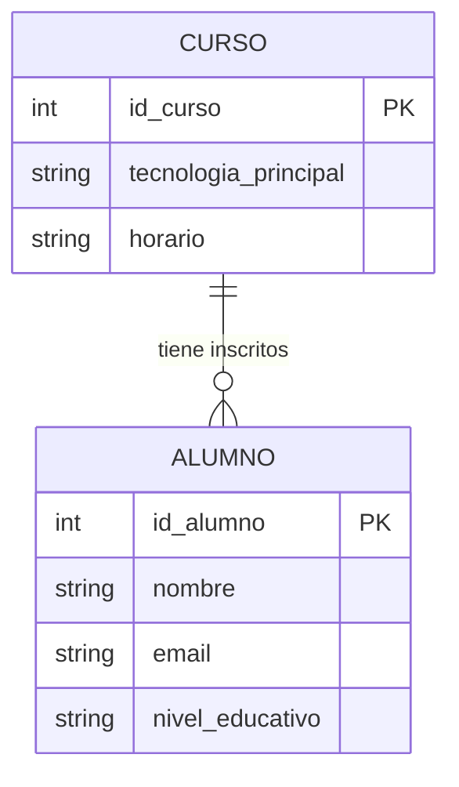

# 01. Introducción a las bases de datos

Una Base de Datos (BBDD) es un sistema que permite guardar un conjunto de datos de forma estructurada y organizada que se almacena en un servidor.

A diferencia de un archivo como un .txt que guardas en tu carpeta, una base de datos real funciona bajo el modelo Cliente-Servidor:

- El Servidor: Es un software que está encendido 24/7. Su único trabajo es recibir peticiones de programas como Java y devolverles la información que han pedido.
- El Cliente (Tu programa): Tu código en Java (o de cualquier otro lenguaje) que envía mensajes (consultas SQL) al servidor para pedir o guardar cosas.

Este sistema permite que miles de personas usen la misma base de datos al mismo tiempo desde distintas partes del mundo.

# 02. Conceptos básicos de bases de datos

### A. Entidades
Son los objetos o conceptos sobre los que queremos guardar información: `Alumno`, `Profesor`, `Coche`, `Libro`, etc.

### B. Atributos
Son las características que describen a una entidad.
* *Ejemplo:* Un `Alumno` tiene `nombre`, `email`, `fecha_nacimiento`, etc.
* **Clave Primaria (Primary Key - PK):** Es el atributo único que identifica a cada registro. No puede repetirse. (Ej: `id_alumno` o `DNI`).

### C. Relaciones
Es la conexión lógica entre dos entidades.
* *Ejemplo:* Un `Alumno` **se inscribe** en un `Curso` (relación entre alumno y curso).

 

## 03. El lenguaje de las bases de datos.

Para que nuestro código en Java pueda hablar con el servidor de base de datos, usamos un lenguaje común: SQL (Structured Query Language).

Independientemente de si usas Java, Python o C#, el mensaje que enviarás al servidor siempre será el mismo. Las bases de datos no usan lenguajes de programación, usan SQL.

## 04. Ejemplo Práctico: Sistema de Gestión CodeMaker

Veamos el ejemplo de la base de datos de Codemaker:

